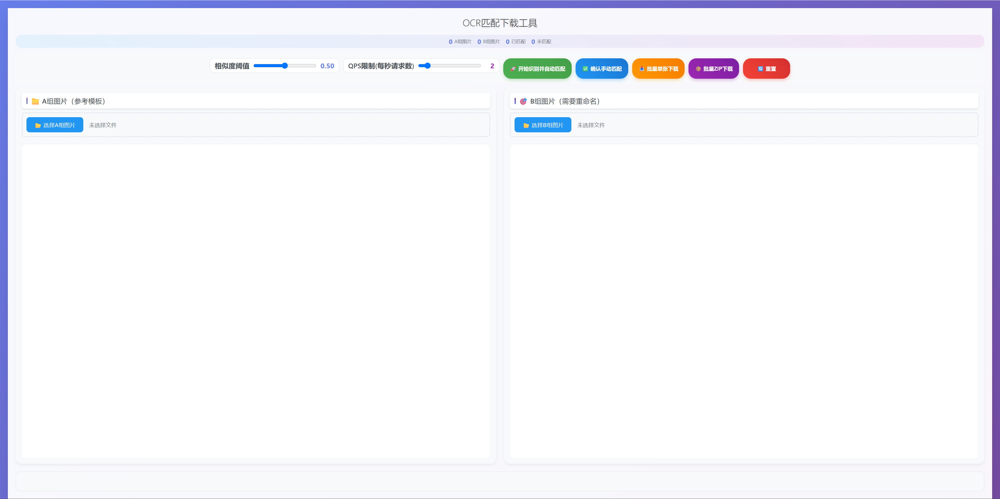
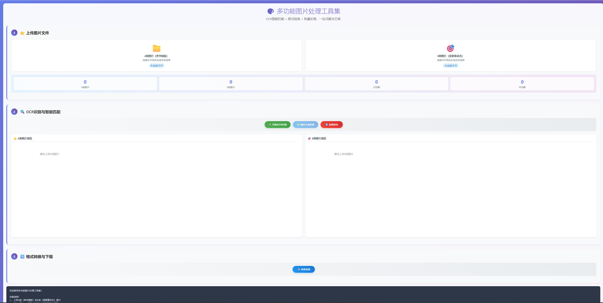

## OCR — 图片 OCR 识别与智能匹配工具

简洁版网页工具，支持将两组图片（A 为模板、B 为待重命名）进行 OCR 识别、智能匹配与一键下载重命名结果。



---

## 功能概览

- **文件导入**: A/B 两组各自选择或拖拽导入，支持多次追加与单张删除。
- **OCR 识别**: 仅识别未识别/失败项；并发度 2；内置全局 QPS 限制（默认 2，可调 1–10）与网络/限流重试。
- **智能匹配与重命名**:
  - 仅匹配与 A 尺寸一致的 B；
  - 文本相似度≥阈值（0–1，默认 0.5）才算匹配；
  - 支持手动匹配与冲突处理（同名冲突会回退冲突 B 并标记 unmatched）。
- **下载**: 批量单张下载或打包 ZIP 下载。
- **可视化**: 网格预览、OCR 文本、分辨率、匹配状态、统计面板与大图预览。

---

## 目录结构

- `index.html`：当前主版本（推荐）。
- `ocrplus.html`：旧版增强页面（保留，仅作备用）。
- `image.png`：`index.html` 截图。
- `ocrplus.png`：`ocrplus.html` 截图。
- `LICENSE`：MIT 许可。

---

## 快速开始

1) 准备后端（本地 Node 代理，转发到百度 OCR）：

```powershell
node server.js
```

- 默认地址：`http://localhost:3000/ocr`（或 `http://0.0.0.0:3000/ocr`）。
- 在 `server.js` 内配置你的百度 OCR API Key（每个账户有免费额度）。

2) 打开前端：

- 直接双击 `index.html` 用浏览器打开。
- 按页面提示导入 A/B 两组图片，点击“开始识别并自动匹配”。

3) 可选：下载结果

- 使用“批量单张下载”或“批量 ZIP 下载”。

---

## API 说明（代理服务）

- `POST /ocr`
  - Request
    ```json
    { "imageBase64": "..." }
    ```
  - Response（示例）
    ```json
    { "words_result": [ { "words": "...", "probability": 0.9 } ] }
    ```

注意：API Key 为私密信息，请勿提交到公共仓库。

---

## 旧版 OCRPlus（保留说明）

`ocrplus.html` 为早期的增强版页面，包含“格式转换与下载”整套流程：



主要差异：

- 增加了格式转换面板（JPG/PNG/WebP/AVIF/ICO 等，质量可调，重命名规则可选）。
- OCR 流程以顺序进度条呈现；不包含主版的阈值/QPS滑块。
- 手动匹配同样要求尺寸一致；提供结果列表与 ZIP 打包下载。

该页面已停止日常维护，建议优先使用 `index.html` 主版。

---

## 常见问题（FAQ）

- 无法识别/报 QPS 限制？
  - 稍等片刻自动重试；或在主版页面降低 QPS 滑块值。
- 相似度阈值怎么调？
  - 识别完成后可拖动滑块，系统会保留手动匹配并重新计算自动匹配。
- 一张 A 被多个 B 匹配怎么办？
  - 内置去重策略：同名冲突时会回退冲突 B，并给出提示。

---

## 许可证

本项目使用 MIT License，详见 `LICENSE`。
